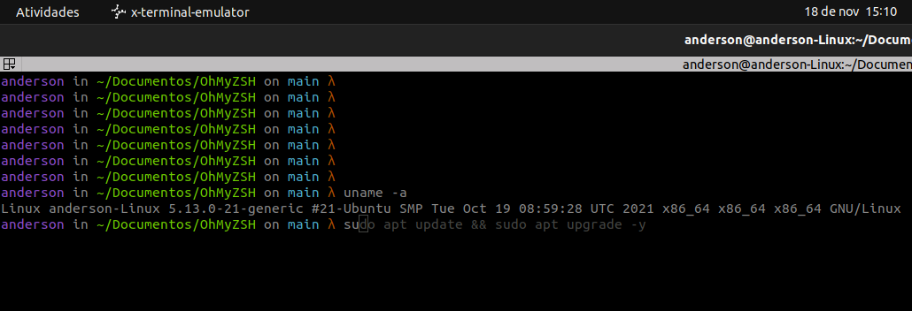

# Modificando o Terminal

Após as modificações o terminal terá algumas funções diferenciadas, como:

- `zdharma/fast-syntax-highlighting`: Adiciona syntax highlighting na hora da escrita de comandos que facilita principalmente em reconhecer comandos que foram digitados de forma incorreta;
- `zsh-users/zsh-autosuggestions`: Sugere comandos baseados no histórico de execução conforme você vai digitando;
- `zsh-users/zsh-completions`: Adiciona milhares de completitions para ferramentas comuns como Yarn, Homebrew, NVM, Node, etc, para você precisar apenas apertar TAB para completar comandos;
- Tema diferenciado.

## Resultado esperado (para este tutorial)


  
## Instalando o ZSH

O ZSH pode ser facilmente instalado apenas com a linha de comando:

```bash
sudo apt install -y zsh
```
Após finalizada a instalação podemos verificar se ela foi bem-sucedida utilizando o comando:

```bash
zsh --version
```
Que deve retornar algo como:

```bash
zsh 5.8 (x86_64-ubuntu-linux-gnu)
```

## Instalando o Oh My ZSH

Para instalar o Oh My Zsh você precisa executar o comando abaixo (você deve ter o cURL instalado para executa-lo):

```bash
sh -c "$(curl -fsSL https://raw.githubusercontent.com/robbyrussell/oh-my-zsh/master/tools/install.sh)"
```

A partir de agora todas configurações que você quiser fazer, como adicionar variáveis ambientes ou configurar seu terminal de qualquer forma, utilize o arquivo ~/.zshrc e não mais o ~/.bash_profile ou derivados.

## Instalando plugins do ZSH

Utilizo alguns plugins bem legais para o Oh My Zsh que facilitam muito na hora de executar comandos comuns, realizar autocompletes, etc...

Para instalar plugins precisamos configurar o ZInit, ferramenta que facilita a instalação e remoção de plugins no Zsh.

Originalmente o ZInit era fornecido pelo repositório do zdharma que não fornece mais atualizações, mas consegui esse repo nomeado zdharma-contiuum que funciona perfeitamente.

```bash
bash -c "$(curl --fail --show-error --silent --location https://raw.githubusercontent.com/zdharma-continuum/zinit/HEAD/scripts/install.sh)"

```

Após essa instalação, vamos abrir o arquivo `~/.zshrc` novamente e adicionamos após a ultima linha deste documento, após o snippet :

```
zinit light zdharma/fast-syntax-highlighting
zinit light zsh-users/zsh-autosuggestions
zinit light zsh-users/zsh-completions
```

# Alterando o tema do zsh

Para alterar o tema do ZSH basta abrir o arquivo `~/.zshrc` com seu editor favorito e alterar a linha `ZSH_THEME=` colocando o tema da sua escolha entre aspas:

```
ZSH_THEME="half-life"
```
Então é só salvar o tema e reiniciar o terminal.

Para escolher um dos milhares de temas disponibilizados você pode conferir o [repositório oficial](https://github.com/ohmyzsh/ohmyzsh/wiki/Themes).
